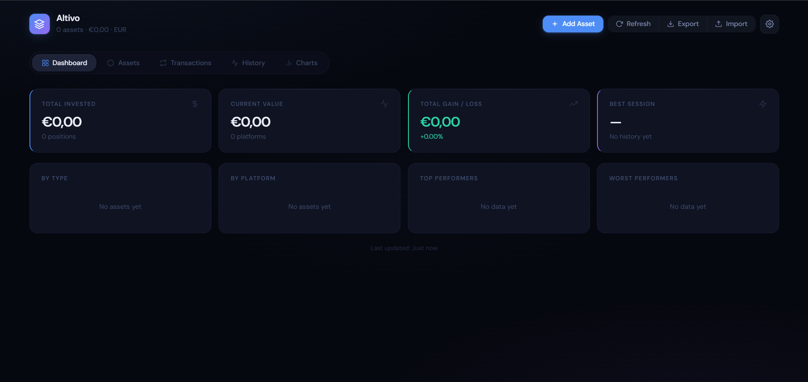
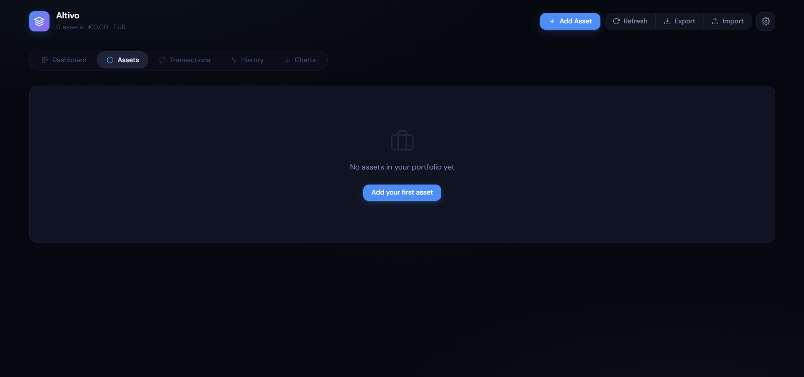
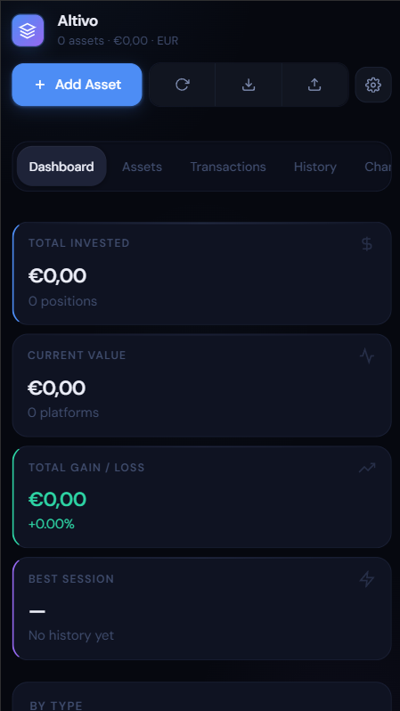

# Altivo

A lightweight and privacy-friendly portfolio tracker focused on simplicity, multi-asset support, and static deployment.



## Live Demo

🌐 https://danieljvsa.github.io/altivo/

---

## Overview

Altivo is a lightweight portfolio dashboard built to help investors track ETFs, stocks, crypto, funds, and other assets in a fast and clean interface.

The project was designed with a simple philosophy:

- No backend required
- Fast loading experience
- Static deployment
- Easy customization
- Self-hostable
- Privacy-friendly approach

The goal was to create a minimal yet modern portfolio experience that can evolve over time while remaining easy to deploy and maintain.

---

## Features

- 📈 Portfolio overview dashboard
- 💰 ETF, stock, fund and crypto support
- 🌍 Multi-currency support
- 📊 Asset allocation visualization
- ⚡ Fast static frontend
- 💾 Local-first persistence
- 🖥️ GitHub Pages deployment
- 📱 Responsive interface
- 🔍 Easy asset management

---

## Tech Stack

- HTML5
- CSS3
- JavaScript
- GitHub Pages

### APIs & Data

- Financial market data APIs
- Crypto price integrations

---

## AI-Assisted Development

This project was developed with the help of:

- Claude AI
- OpenCode AI
- DeepSeek V4 Flash
- Qwen 3.6 Plus

AI was mainly used for:

- Rapid prototyping
- UI iteration
- Architecture brainstorming
- Debugging assistance
- Feature refinement
- Improving development speed

---

## Why I Built This

I wanted a lightweight and customizable portfolio tracker that could be hosted statically without requiring backend infrastructure.

Most portfolio tools are either:

- Too complex
- Too heavy
- Subscription-based
- Not privacy-friendly

Altivo started as an experiment to explore rapid MVP development combined with AI-assisted workflows.

It also became an opportunity to improve product thinking, frontend UX awareness, and fast iteration capabilities alongside my backend engineering experience.

---

## Project Goals

The main objectives for Altivo were:

- Keep the application lightweight
- Support multiple asset types
- Allow simple deployment
- Provide a clean user experience
- Explore AI-assisted development workflows

---

## Architecture

The project follows a simple frontend-first architecture:

```text
Browser
   ↓
Static Frontend (HTML/CSS/JS)
   ↓
External Market APIs
```

No dedicated backend is required.

Data persistence is handled locally in the browser.

---

## Running Locally

Clone the repository:

```bash
git clone https://github.com/danieljvsa/altivo.git
```

Open the project folder:

```bash
cd altivo
```

Run locally using a simple server:

```bash
python -m http.server 8080
```

Or use VSCode Live Server.

---

## Deployment

The project is deployed using GitHub Pages.

To deploy:

1. Push changes to the repository
2. Enable GitHub Pages
3. Select the main branch
4. Publish

---

## Roadmap

- [ ] Better crypto integrations
- [ ] Historical asset charts
- [ ] Portfolio performance analytics
- [ ] Asset import/export
- [ ] Mobile experience improvements
- [ ] Optional authentication layer
- [ ] Better currency handling
- [ ] Public shareable portfolios

---

## Screenshots

### Dashboard


### Portfolio View



### Mobile View



---

## Built With AI Assistance

This project was developed with AI-assisted workflows using Claude AI, OpenCode, DeepSeek and Qwen models for rapid prototyping, iteration, debugging, and development acceleration.

AI did not replace development decisions, architecture, or product direction — it accelerated iteration and reduced development friction.

---

## Author

Daniel Sá

- Portfolio: https://danieljvsa.vercel.app/
- GitHub: https://github.com/danieljvsa

---

## License

MIT License
